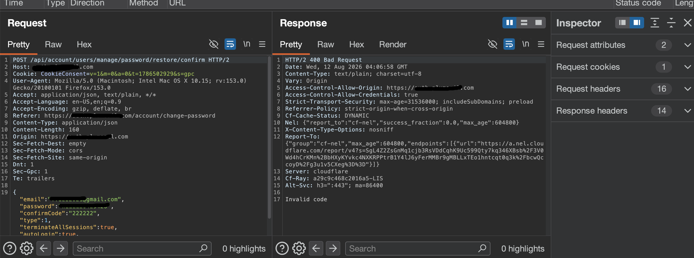

Password Reset OTP Bypass via Response Manipulation Using HTTP Status Codes

First, we go to the Forgot Password function.

We enter the email address we want to target.

Before starting the attack, we first use the real OTP code to understand how the server behaves when it receives a valid code. This gives us a baseline for comparison.

Now we start intercepting the traffic using Burp Suite. Here, we can see the request and response.

We save the response for later comparison. As we can see, the process works normally and the application takes us to the password-changing function.

Next, we try to change the password while intercepting the requests and responses.

The first request is not important for the bypass. It is only used to check whether the password meets the application's requirements.

After this request, we get the actual password-changing request.

From the normal flow, we can see that the successful requests return HTTP 200 OK.

Now we try using a wrong OTP code.

The previous flow used the real OTP. This time, we intentionally enter an incorrect code.

If we submit the wrong code normally, the application tells us that the OTP is invalid. We use Burp Suite to intercept the response and see how the server responds.

The server returns:
HTTP/2 400 Bad Request
From the legitimate flow, we know that a successful request returns:
HTTP/2 200 OK
This gives us an interesting difference between the valid and invalid flows.
We intercept the response and modify the status code from 400 Bad Request to 200 OK.
After forwarding the modified response, the application accepts the response and takes us to the password-changing page.

However, when we try to complete the password change, the application performs another OTP validation. The request still returns 400, meaning that the OTP is being verified again during the password-changing stage.

We then perform the same response manipulation on the next validation response and change the status code to 200 OK.

After this, the application accepts the modified responses and completes the password-reset process.

The main issue is response manipulation via HTTP status codes. The client is using the server's response status to determine whether the OTP verification was successful. Since the response can be intercepted and modified before the client processes it, this should not be trusted as a security boundary.

